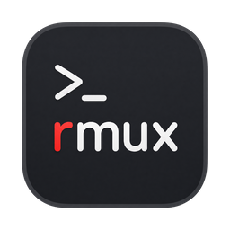

<div align="center">



# rmux

**Run Claude Code on every machine you own, from one window.**

A fast, direct-SSH remote development client. Rust core, native webview, no relay.

[](https://www.rust-lang.org)
[](https://tauri.app)
[](https://react.dev)
[](#install)

</div>

---

## What it is

rmux is a desktop client for running **several Claude Code sessions at once**, across
several machines, without losing track of any of them.

The question it answers is not *"what is in this folder"* — an IDE already does that. It is
**"which of my sessions needs me right now?"** So sessions are first-class: always listed,
always showing status, and switching between them is instant because nothing is ever torn
down.

Everything on the remote-coding path — terminals, files, metrics, Claude itself — is a
**direct SSH connection from your machine to the target**. There is no server in the middle,
and that is the entire point.

<div align="center">
<em>Screenshot goes here — replace with a capture of the workbench in 2×2 grid mode.</em>
</div>

## Why direct SSH

The previous generation of this tool relayed sessions through a server, and every serious bug
it had came from that one decision: permission cards shown after they were answered, answers
delivered to a screen that had moved on, sessions reaped by a heartbeat poller, keep-alives
left stale after an API redeploy.

rmux removes the hop. A prompt is read from the terminal you are actually looking at, and
answered on that same screen, synchronously. Both failure modes stop being possible rather
than being worked around.

A shared server is still used — for sign-in, the team's server registry, messaging and Jira —
but **never for a session**. Sign-in is optional; the workbench opens straight into work with
no account at all.

## Features

### Sessions that outlive the app

Terminals and Claude conversations run under `rmux-agent` **on the target**, so they survive
quitting rmux, losing the network, and closing the lid. Reopening reattaches to the same
shell with its scrollback intact.

- **Resume anything, from anywhere.** Pick a server, list every Claude conversation on it,
  and resume one — the project folder is set for you, read from the transcript's own `cwd`.
  No hunting through a file tree first.
- **Choose the leash per session.** Start supervised, or with
  `--dangerously-skip-permissions` for a machine you would happily rebuild. Asked at launch
  rather than stored as a default, and it travels with that session so a restart cannot
  quietly change it.
- **Reconnect after sleep.** A dropped SSH connection is detected and reattached rather than
  leaving a frozen pane.
- **Closing a session ends its work** — deliberately, and it says so before it does.

### The grid

Watch up to sixteen sessions at once (2×2, 3×3, 4×4). Click a cell, then click any session in
the rail to put it there. The instrument rail follows the cell you last touched.

### Claude, rendered as Claude

The real `claude` CLI in a real terminal — every slash command, mode, picker and vim binding
works, because it *is* the CLI. Rendered **inline** rather than fullscreen, which is what
makes text selectable and scrolling local instead of a network round trip.

- Context-window meter, read from Claude's own banner rather than guessed
- Mode, permissions and model at a glance
- Native notifications when a session finishes or asks you something
- Paste or drop an image — even into a **remote** session, where Claude has no clipboard

### Instruments

A rail of glanceable state for the session you are in: host CPU / RAM / network, top
processes, token spend, context, a clock, a per-session scratch note, and Jira progress.
Drag to reorder.

### Liquid Glass

On macOS 26 the window can use Apple's own `NSGlassEffectView`, so it genuinely refracts your
wallpaper instead of blurring a copy of it — the compositor already has the desktop, and a web
page never can. Off by default, and simply absent on platforms without it rather than offered
as a switch that does nothing.

### The host

Manage the machine without leaving the app: browse and kill processes, discover listening
ports, forward them, or open a SOCKS proxy onto the target.

### Files

A remote file tree and a Monaco editor, over the same connection. Office documents and
Markdown render inline. Saving **copies over the original** rather than replacing the inode,
so permissions, ownership and hard links survive.

### Jira

Bind a project to a session and a Jira tab appears — your issues, their real workflow
transitions, and comments.

### The lock

Off by default. When on, a PIN **encrypts** your stored session with XChaCha20-Poly1305 under
an argon2id key: unlocking *is* decryption, so there is no comparison to bypass and a wrong
PIN yields nothing. Face unlock is offered as a convenience over typing, never as the floor.

## Install

**macOS (Apple Silicon)** — download the `.dmg` from Releases. It is signed and notarised, so
it opens with no warning.

Building from source:

```sh
pnpm install
pnpm tauri dev          # development — starts Vite and the app together
pnpm tauri build        # a real bundle
```

> **Never build the release binary with `cargo build --release` directly.** Tauri only serves
> its embedded UI when compiled with the `custom-protocol` feature, which `pnpm tauri build`
> passes. Without it you get a blank window and no error.

Persistent remote terminals need the cross-compiled agents:

```sh
scripts/build-agents.sh   # needs cargo-zigbuild + zig
```

## Architecture

```
crates/rmux-transport   Target trait: Local | Ssh — the seam everything is written against
crates/rmux-ssh         system `ssh` + ControlMaster; askpass bridge; tunnels
crates/rmux-agent       remote daemon + thin stdio proxy — why sessions survive
crates/rmux-term        local PTY + scrollback; terminals outlive their views
crates/rmux-fs          FileSystem trait: LocalFs | TargetFs (POSIX shell over ssh)
crates/rmux-metrics     CPU/memory/network sampled over the existing connection
crates/rmux-claude      Claude PTY control, screen parsing, transcript reading
crates/rmux-control     the socket other apps drive rmux through
crates/rmux-cowork      team-server client + OS keyring
server/                 the team server (NestJS)
src-tauri/              thin IPC layer only — no logic
ui/                     React 19 + Tailwind 4 + motion
```

**One rule holds the design together:** local and remote are a single code path. Everything
is written against `rmux_transport::Target`, and there is never an `if is_local` branch in
feature code — the branch belongs in the `Target` impl. `Target::build_command` resolves to a
*locally* spawnable argv, so terminal code always spawns a local PTY and never learns SSH
exists.

`~/.ssh/config` is never parsed by rmux. Host aliases go to the `ssh` binary verbatim, which
is why `Match`, `Include`, `ProxyJump`, certificates, FIDO keys and 2FA all work for free.

## rmux as a backend

Other applications can drive rmux over a local socket (`~/.rmux/control.sock`, `0600`, with a
per-run token): list and activate sessions, subscribe to session events, open an `ssh -D`
SOCKS proxy, and send back observations from a browser — a DOM selection, a screenshot,
console output, a HAR.

NDJSON, so a client is `socket.on("data")` and `JSON.parse` — no codec to port.

## Contributing

Contributions are welcome. A few things this codebase asks for:

**Comments explain *why*.** Not what the line does — why it is that way, and what broke when
it wasn't. Most of the hard-won knowledge here is in comments, and a change that removes the
reasoning is worse than one that removes the code.

**Prove a test can fail.** Break the behaviour, watch the test go red, then fix it. Several
tests here were written against bugs that had already shipped.

**Before opening a PR:**

```sh
cargo test --workspace
cargo clippy --workspace --all-targets   # must be clean
pnpm exec tsc --noEmit
```

Some checks run in a real browser rather than Node, because a stub cannot prove what they
test — open them under `pnpm tauri dev` and read the console:

| | |
|---|---|
| `ui/xterm-glass-check.html` | terminal transparency against a real xterm |
| `ui/xterm-clipboard-check.html` | selection and mouse reporting |
| `ui/office-check.html` | `.docx` / `.xlsx` readers against real fixtures |

**Design system.** `ui/src/styles/signal-room.css` is the source of truth. Red only where the
operator must act; zero border-radius; blinking is for cursors alone; no emoji — inline SVG
only.

**Security.** Secrets never travel in argv (`ps` shows one user's command line to every
account on a host). Anything interpolated into a remote shell line goes through
`shell_quote`. Credential sockets are `0600` inside `0700` directories with a per-run token.

`CLAUDE.md` carries the full set of invariants and the reasoning behind them. Read it before
changing anything structural — most of it was written the hard way.

## License

Not yet chosen. Until one is added, all rights are reserved.
